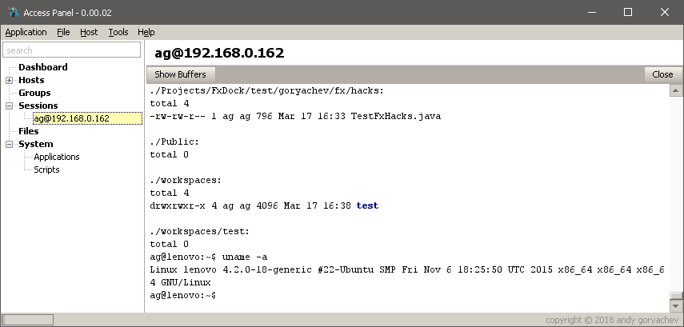

# Access Panel

## Features

* encrypted storage of credentials, keys, and local files
* multiple terminals
* powerful log viewer
* file manager
* VNC viewer
* Linux management GUI similar to CPanel, Webmin
* batch configuration tools à la Ansible
* scripting notebook