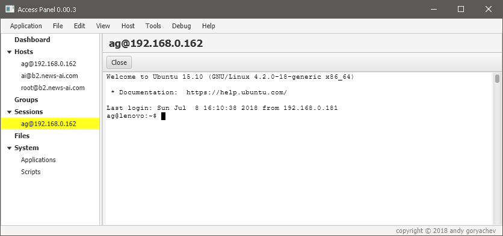
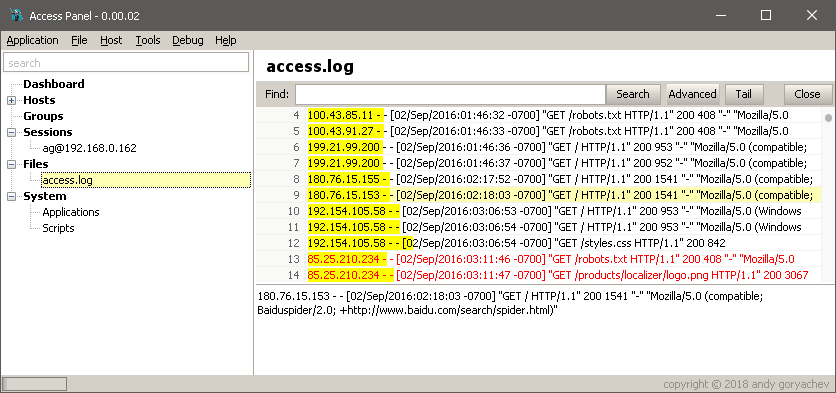

# Access Panel

## Features

* multiple ssh terminal windows
* log viewer
* vnc viewer
* remote file browser
* server control tools

## Security

* credentials, keys, local files are encrypted locally
* temporary files are encrypted with ephemeral keys
* configurable application window lock

## SSH Terminals

* unicode support
* workspace remembers and restores terminal connections and layout

## Log Viewer

* works with local and remote files
* timeline
* tailing
* advanced search with regex, wildcards, and highlights 
* date queries
* extract and plot variables

## Server Control Tools

* GUI for Linux components (iptables, nginx, apache, ...)
* multi-server command executor with variables and scripting
* GUI for common tasks like let's encrypt, zip and download logs, ...

## Other Features

* workspace remembers and reloads sessions and files

